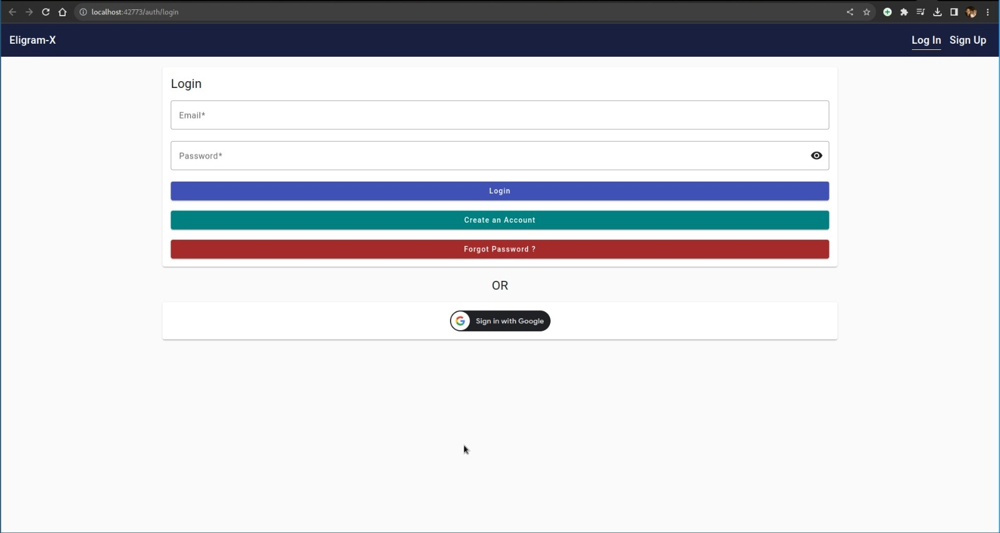
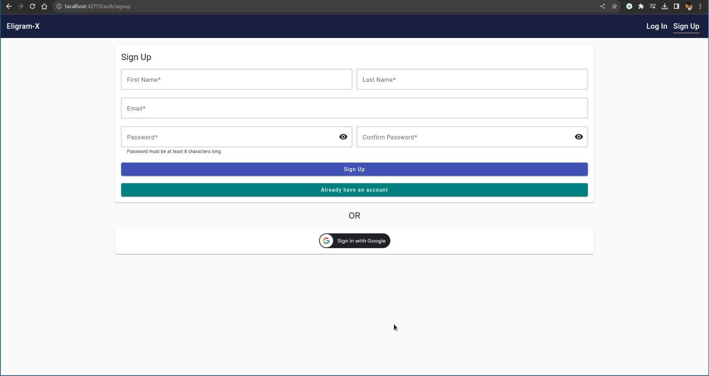
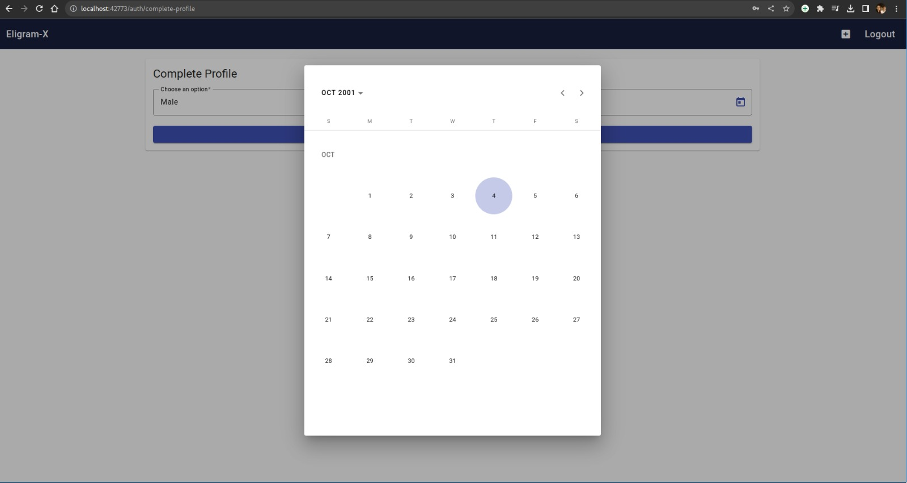
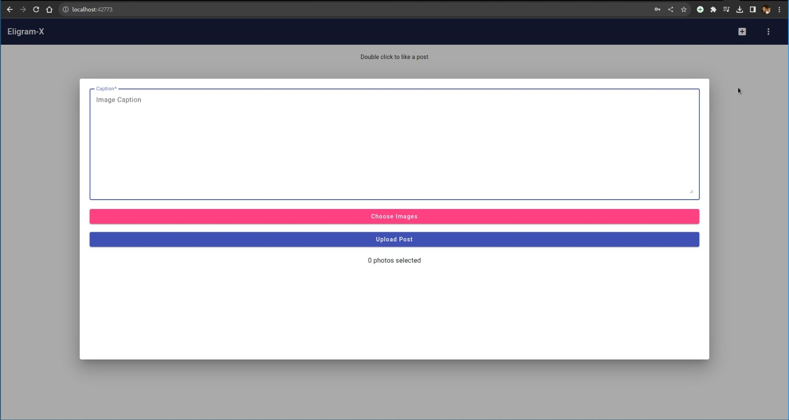
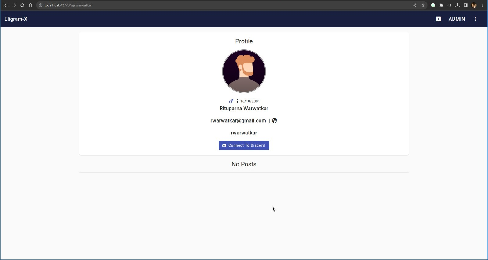
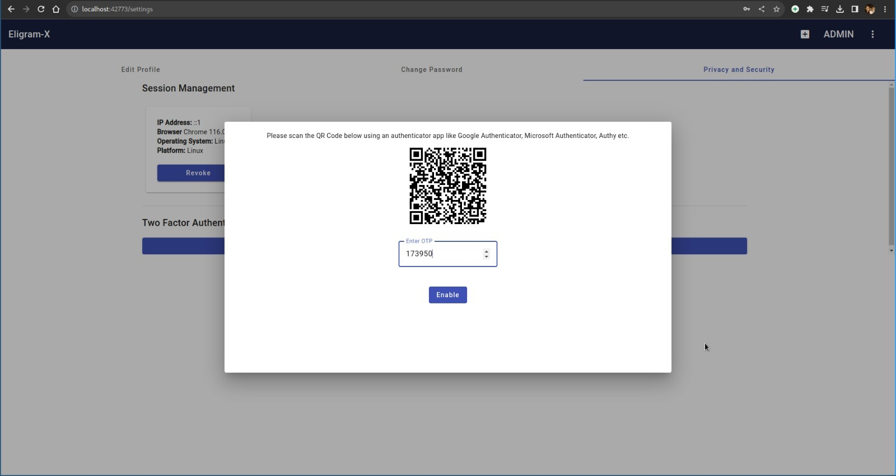
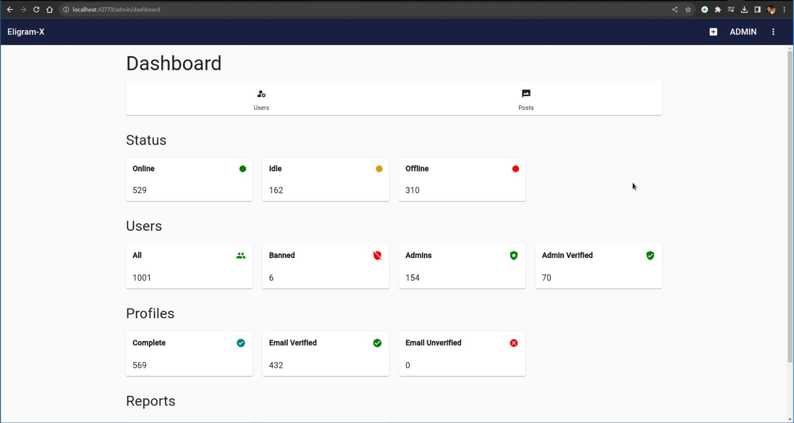
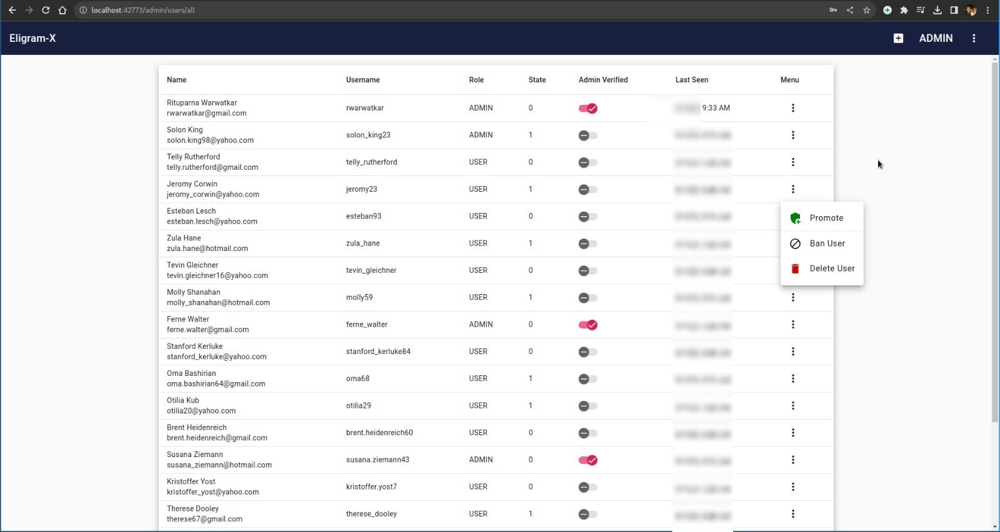

# Eligram-X

Eligram-X is a feature-rich social media platform that leverages the MEAN stack (MongoDB, Express, Angular, Node.js) for its web application with a beautiful User Interface using the Google Material Design, with additional technologies such as Redis for caching and session management, Firebase for file storage, and Discord and Telegram for logging and back-office functionalities. This platform aims to redefine the social media experience by introducing advanced features and robust security measures.

## Features

- **Admin Panel**: Eligram-X includes a comprehensive admin panel exclusively for platform administrators to manage user data, posts, reports, roles, and more.

- **Authentication and Authorization**: The application emphasizes authentication and authorization, incorporating OAuth for social login (e.g., "Sign In With Google", "Connect to Discord"), session management, email verification using OTP, new device detection on login, and two-factor authentication (2FA) via Time-Based OTP with support for popular authenticator apps.

- **Session Insights**: Users can monitor their active sessions, revoke logins from various devices, and access location and device details, including GeoIP data.

- **Real-Time Communication**: Eligram-X utilizes WebSockets for real-time communication, ensuring seamless interaction among users.

- **Push Notifications**: With the help of service workers, the platform sends push notifications to keep users updated even when their browsers are closed.

- **Integration with External Platforms**: Integration with Discord, Telegram, and potentially Slack facilitates communication and updates for site admins, ensuring they are always in the loop, even when offline.

## Tech Stack

- **Backend**: Node.js, Express.js

- **Database**: MongoDB, Redis

- **Frontend**: Angular, Material Design

- **File Storage**: Firebase Cloud Storage

- **Real-Time Communication**: WebSockets

- **Mobile Application (Future)**: Flutter (using the same backend)

## Installation

You need to have NodeJS, MongoDB and Redis up and running. Also obtain a Firebase Service account credentials for file uploads. You also need to have the angular CLI installed.

1. Clone the repository:

```
git clone https://github.com/rituparna-ui/eligram-x.git
```

2. Navigate to the project directory:

```
cd eligram-x
```

3. Install dependencies:

Since this application has its backend and frontend decoupled, we need to install dependencies in two different directories i.e. `server` and `client`

```
cd client
npm install
cd ../server
npm install
```

4. Set up the environment variables:

   1. Fill in the necessary details for database configuration and Firebase Service account credentials.
   2. Set up your preferred mailing service (Gmail OAuth or SendGrid API)

5. Start the server:

```
npm start
```

6. Navigate to the `client` directory and start the angular development server

```
ng serve
```

7. Access the application in your browser at `http://localhost:4200`

## Previews

### Login



### Signup



### Profile Completion



### Create Post



### Profile Page



### Profile Settings



### Admin Dashboard



###


